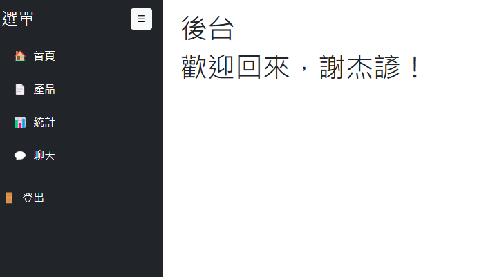
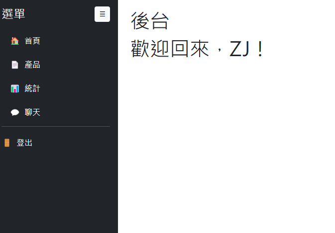

NPTU class 需要 
===
----
2025/04/24
--- 
### 新增login、register 頁面 
### 新增compoents 資料夾(把共同的code 寫在裡面範例:nav 、footer)
### database.php 修改為本地端 還沒測試是否正常 
### 下次完成 login 跟register 頁面或許會完善?

#### 負責人: ZJ  2025/04/24 23:09:38
---
2025/04/25
### 新增register.php後端，login後端有微調
-  login.php增加權限的條件判斷(admin or user?)
-  可能要新增admin的後臺管理頁面?因為有分權限;register的user name 還沒加
#### by ziz 4/26 00:47
---
2025/04/27
###  register跟login 大蓋好了也把錯誤那邊的修正用alert去提醒user
###  後台dashboard 以新增sidebar 後台也會隨著不同的admin 人員去顯示他的名字
###  action/common.php 用來放常用的function
###  輸入框都有新增強制要求user 輸入才不會出錯

#### 負責人: ZJ  2025/04/27 09:45

### 新增後台 管理員 可以調整權限 (目前只有畫面尚未實裝function )
### 新增後台product 不知道該如何呈現 請詳問 ziz03
### 後台新增麵包屑可以讓管理員知道他在哪裡

#### 負責人: ZJ  2025/04/27 22:28
---