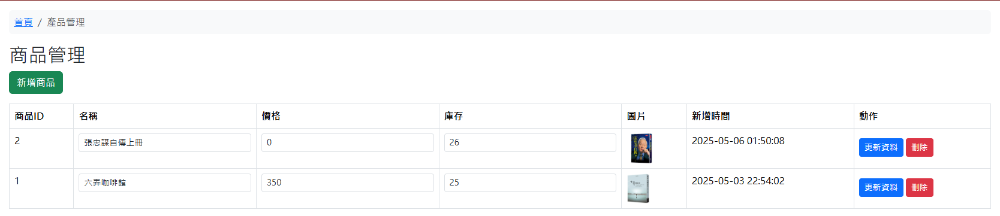
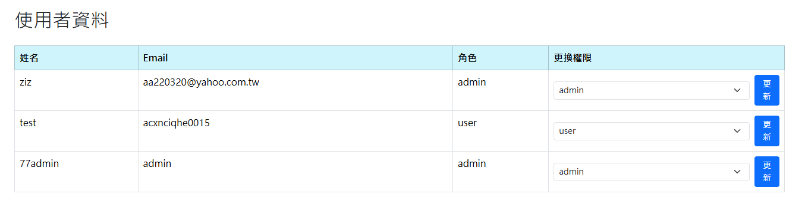
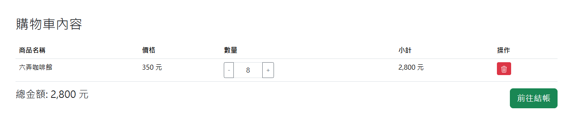
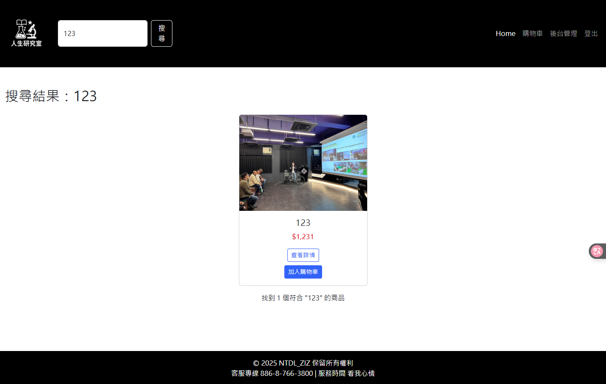
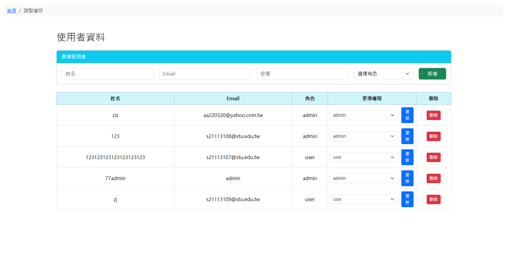

# NPTU Class 更新紀錄

## 📅 目錄（點擊跳至對應日期）

- [20250424](#20250424)
- [20250425](#20250425)
- [20250427](#20250427)
- [20250503](#20250503)
- [20250504](#20250504)
- [20250507](#20250507)
- [20250508](#20250508)
- [20250510](#20250510)

---

## 20250424
---

### 新增 login、register 頁面  
### 新增 components 資料夾（把共同的 code 寫在裡面，範例：nav、footer）  
### `database.php` 修改為本地端，尚未測試是否正常  
### 下次完成 login 跟 register 頁面或許會完善？  

#### 負責人: ZJ 2025/04/24 23:09:38

---

## 20250425
---

### 新增 `register.php` 後端，`login` 後端微調  
- `login.php` 增加權限判斷（admin or user）  
- 可能要新增 admin 後臺管理頁面？因為有分權限  
- `register` 的 username 還沒加  

#### by ziz 2025/04/26 00:47

---

## 20250427
---

### register 跟 login 大致完成，錯誤提示用 alert  
### 後台 dashboard 新增 sidebar，可顯示不同 admin 名字  
### `action/common.php` 建立放常用 function  
### 輸入框新增必填限制防止出錯  

  

#### 負責人: ZJ 2025/04/27 09:45

---

### 新增後臺 管理員可調整權限（僅有畫面，功能未實裝）  
### 新增後台 product 相關畫面（未完成，詢問 ziz03）  
### 後台新增麵包屑功能

#### 負責人: ZJ 2025/04/27 22:28

---

### 新增 user center（尚未完成）

#### 負責人: ZJ 2025/04/27 22:28

---

## 20250503
---

### 修改 logo（image/blackLOGO.png）  
### 修正一些 bug  
### 新增 forgotPassword  

#### 負責人: ZJ 2025/05/03 00:00

---

### 修正 logo 問題，新增購物車前後端（尚未完善）與首頁按鈕  
### icon 靈異事件  
#### by ziz 2025/05/03 15:00

---

### 已修正 logo 問題（nav include 的位置調整）  

#### by ZJ 2025/05/03 16:00

---

### admin 後台：商品列表和新增商品完成（可再優化）  
- `product.php` 可查看商品詳情  
- 首頁「查看詳情」功能完成，但排版尚需改善  
- 接下來要做購物車與結帳流程  
#### by ziz 2025/05/03 23:04

---

### 修改 `product.php` 排版  
#### by ZJ 2025/05/03 23:59

---

## 20250504
---

### `product.php` 排版優化、加入刪除功能（編輯未完成）  
### `index.php` 顯示 product 資料表內容  
### `product_add.php` 支援圖片上傳至 image 資料夾並儲存資料庫路徑  

#### by ZJ 2025/05/04 23:16

---

## 20250507
---

### 修改 `product.php` 查看詳情路徑錯誤問題  

#### by ZJ 2025/05/07 23:53

---

## 20250508
---

### 修改 `cart.php` 可更新商品數量  
### 新增 `action/cart.php` update 方法  
### 新增 `admin/products.php` 更改庫存功能  

#### by 77 2025/05/08 00:54

---

### `admin/products.php` 支援修改商品名稱與金額  
### 整合按鈕：名稱、金額、庫存一鍵修改  

#### by 77 2025/05/08 01:13

---

### 新增 `admin/changestatus.php` 修改使用者權限功能  

#### by 77 2025/05/08 02:13

---

### 調整資料表關聯限制，可刪除  
- 新增結帳前後端，但送出未完成  
- 搜尋與分頁功能待開發（課堂要求）  
- 預計加入 30 筆資料（呈現方式待討論）  
- 首頁新增「關於我們」nav（已建 table）  
- nav icon 尚未處理  

#### by ziz 2025/05/08 14:00

---

### 修改 `cart.php` 數量更新樣式，移除按鈕改為 icon  

#### by 77 2025/05/08 16:11

---

### `index.php` 新增搜尋框功能，邏輯在 `action/common.php`  

#### by ZJ 2025/05/08 22:29

---

### `changestatus.php` 新增使用者編輯與刪除功能  

#### by 77 2025/05/08 22:58

---

### 修改 `products.php` 商品依 ID 小到大排序  

#### by 77 2025/05/08 23:10

---

## 20250510
---

### 新增 nav icon 與結帳送出功能  
- admin 後台新增訂單明細查看功能  
- 每頁顯示 5 筆並支援分頁與搜尋  
- 預計首頁加入所有商品，支援搜尋與分頁  
- 使用者可在購物車中直接輸入數量  
- admin 後台首頁考慮美化  

#### by ziz 2025/05/10 01:12

---

### 修改 `admin/compoents/sidebar.php` 收縮問題  
### 新增 `Allproduct.php` 顯示所有產品（尚未新增資料）  
### 修改 `action/common.php` 的 `displayProductsList` 方法支援 `limit` 傳入  

#### by ZJ 2025/05/10 12:27
---
### `allproduct`裡面分頁功能改好了(一頁limit=3)
- `forgotpwd`的bug修好了
### by ziz 2025/05/10  23:22